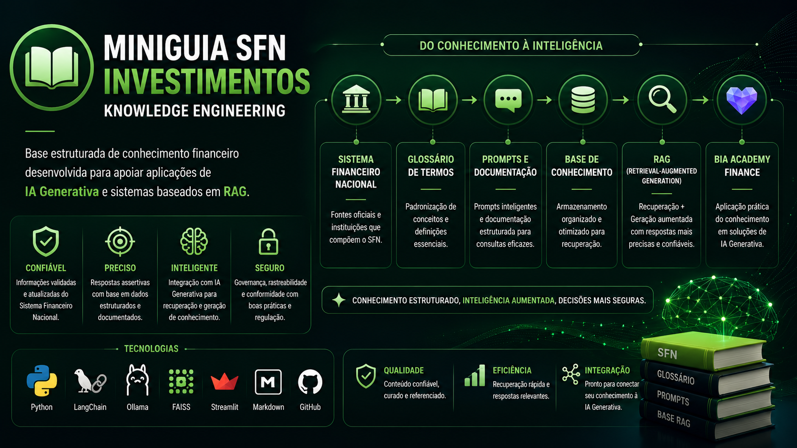

<p align="center">
  
</p>

# 📘 MiniGuia SFN Investimentos

> **Knowledge Engineering para IA Generativa**
>
> Base estruturada de conhecimento sobre o Sistema Financeiro Nacional desenvolvida no **NotebookLM**, servindo como fundamento para aplicações de IA Generativa e RAG.

---

# 📌 Sobre o Projeto

O **MiniGuia SFN Investimentos** foi desenvolvido como uma base organizada de conhecimento sobre o Sistema Financeiro Nacional (SFN), reunindo conteúdos oficiais, conceitos e documentação em um ambiente estruturado.

O projeto teve como objetivo validar uma abordagem de **Engenharia de Conhecimento (Knowledge Engineering)** para apoiar futuras aplicações de Inteligência Artificial voltadas à educação financeira.

Essa estrutura tornou-se posteriormente a base conceitual utilizada na construção da **BIA Academy Finance**.

---

# 🎯 Objetivos

- Organizar conhecimento financeiro de forma estruturada
- Centralizar conteúdos sobre o Sistema Financeiro Nacional
- Facilitar consultas e recuperação de informações
- Criar uma base preparada para aplicações com IA Generativa
- Demonstrar boas práticas de Engenharia de Conhecimento

---

# 🧠 Arquitetura do Conhecimento

```text
Fontes Oficiais
        │
        ▼
 Organização do Conteúdo
        │
        ▼
 Glossário • Conceitos • Documentação
        │
        ▼
 Base Estruturada no NotebookLM
        │
        ▼
 Recuperação Inteligente
        │
        ▼
 Aplicações de IA Generativa
```

---

# 🚀 Principais Recursos

- 📚 Base de conhecimento estruturada
- 🏛️ Conteúdo sobre o Sistema Financeiro Nacional
- 📖 Glossário financeiro organizado
- 🔍 Recuperação rápida de informações
- 🧠 Estrutura preparada para RAG
- 💙 Base utilizada na BIA Academy Finance

---

# 🛠️ Tecnologias

| Ferramenta | Finalidade |
|------------|------------|
| NotebookLM | Organização e recuperação do conhecimento |
| Markdown | Documentação |
| GitHub | Versionamento |

---

# 💼 Competências Demonstradas

- Knowledge Engineering
- Organização de Informação
- Curadoria de Conteúdo
- Estruturação de Base de Conhecimento
- IA Generativa
- Retrieval-Augmented Generation (RAG)
- Documentação Técnica

---

# 🌐 Papel no Ecossistema

O MiniGuia representa o primeiro projeto do ecossistema apresentado neste portfólio.

Sua função é fornecer conhecimento estruturado para aplicações de Inteligência Artificial, sendo a base utilizada posteriormente pela **BIA Academy Finance**.

```text
MiniGuia SFN
      │
      ▼
Base de Conhecimento
      │
      ▼
RAG
      │
      ▼
BIA Academy Finance
```

---

# 📷 Visão Geral

<p align="center">

</p>

---

# 👩‍💻 Autora

**Barbara Freitas**

Data Analytics • Machine Learning • Generative AI • Financial Intelligence

[LinkedIn](https://www.linkedin.com/in/barbarafreitas-dataanalytics)
